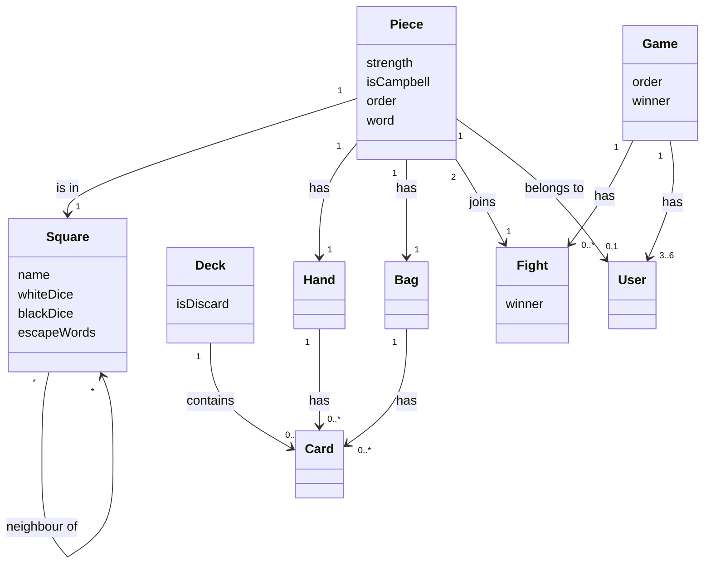
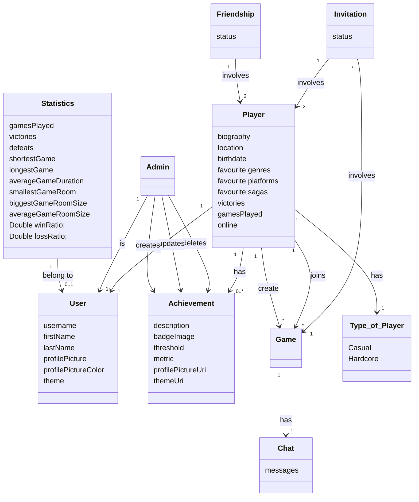

# Documento de análisis de requisitos del sistema

## Introducción

### General Description of the System to Be Developed

Our project will focus on developing a web implementation of the board game “Escape from Elba”, an exciting game that combines randomness and strategy in a perfect way, ideal for playing with family or friends in multiplayer mode (for 3-6 players per game). This project aims to attract a wide audience that enjoys not long strategy games.

"Escape from Elba" is a board game inspired by the historical escape of Napoleon Bonaparte from the island of Elba in 1814. In this game, the board represents “Elba”, and each player believes they are Napoleon. Players compete against each other to escape from the island before anyone else, while interacting with NPCs (non-player characters) and Niall Campbell.

The system relies on a dice-based mechanic to track players' progress and determine the outcomes of confrontations. Players also manage a hand of cards that represent letters needed to form words. These words are placed in each player's "bag" and can be used as weapons or as escape words.

### Objectives of the game

The primary objective of the system is to simulate the competitive environment where multiple "Napoleons" try to escape Elba. The key concepts are the following:

- **Increase Strength**: Players need to increase their strength by fighting other players or non-player characters. Strength is a critical factor, as it increases the likelihood of a successful escape attempt.

- **Hinder Other Players**: By battling other players, they can steal cards and force them to relocate randomly on the board.

- **Manipulate Non-Player Characters**: The game includes non-player characters, such as Niall Campbell and other NPCs. These characters do not follow the same rules as player-controlled Napoleons, but players can manipulate their movement.

- **Escape the Island**: The ultimate goal for any player is to escape the island of Elba by forming specific escape words. These words allow the player to attempt an escape from the island based on their strength and position.

### General game mechanics
The general game mechanics are:
#### Action points mechanics
- Each player is a dice which represents its strength, which influences combat and escape attempts.
- During a combat, two players have to throw one dice each, the result will be added to each player's strength points.
- After a combat, the loser throws two dices to decide in which square is landing.
#### Player mechanics
- A player can move to the neighbor squares around its square (it will be able to move a maximum of n times, being n the number of actoin points they have per round)
- A player can start a combat with other players by going to their squares.
- A player can put the players to vote if the player thinks that he can form a weapon word that is not in the set of weapon words.
- A player can decide if a word that’s been put to vote is a valid weapon (or not).
#### Board mechanics
- The game includes 64 cards, a board, and many dices. Each player is represented by an icon that tracks their strength, starting at 1 and potentially increasing up to 6 through losing combats.
- The board consists of various rooms, each labeled with different words. Certain rooms are needed for escape attempts.
#### Dice mechanics
- Each player makes use of a dice to track their strength, which influences their likeliness to win a fight or escape.
- During a fight, both guests will roll a dice. The result will be added to their strength in order to determine the winner.
- At the beggining of the game each player will roll two dices to determine their initial position
- In case that a player loses a fight, they will roll two dices again to determine their new location
#### Card mechanics
- At the beggining of their turn, each player will be able to draw cards up to a maximum hand size of 7 cards. The difference between 7 and the cards in the hand will determine the number of action points for that round.
- By winning fights, players will be able to obtain more cards
- At the end of their turn, players will discard all the cards they want to keep into their bags and the rest will go to the discard pile
#### Escape mechanics
- A player will be able to try to escape anywhere with the words CAMPBELL or EMPEROR
- If a player has the any of the other escape words, they can only attempt to escape in the designated room for that word
- An escape attempt is not always succesful and will be determined by a dice roll and your strength. In case the player fails, the consequences will be the same as losing a fight.
#### Fighting mechanics
- A fight starts when a player moves into an already occupied room
- It is mandatory to fight when two players cross paths, unless it is in the safe area. In case two non-players encounter, they will not fight
- In case of a tie, the attacker wins (Attacker meaning the person that caused the fight entering the room)
- During a fight, both guests will roll a dice. The result will be added to their strength in order to determine the winner.
- Players may also have Weapons in their bag. In case they have them, each one will represent a boost of an extra point in their result.
- The winner gets a card and the loser gets catapulted to a random room. The loser also gains a Strength point, up to a maximum of 6.
- Depending on the participants of the fight, its results are quite different:
  * Player beats Player: The winner takes a card of his choice form the loser's bag or a random card from the loser's hand. The prize always goes into the winner's hand. If the active player loses, they loose all their remaining action points.
  * Player beats Non Player: The winner draws from the deck
  * Player Beats Niall Campbell: The winner takes the top card of the discard pile, if there is already one
  * Non Player beats Player: The loser must discard a card of their choice from their Hand or their Bag. This is the same consequence as of a failed escape attempt
  * Fighting Multiple Guests: If a player enters a room with multiple guests. They will have to fight them all in any order. If they get knocked out, they will not fight the rest
  * In case a player gets thrown to the same room, they will have to fight again

### Word mechanics
- Escape words can be formed within the cards in the bag to escape.
- Weapon words can be formed in order to have an extra point in a fight.
### Victory criteria
The victory criteria involves successfully escaping from the island by fulfulling certain conditions:
 1) The player must have a Escape Word in their bag and be standing in the correct room for that word (in the case of the words ESCAPE, FROM, ELBA, PEACE) or in any room (in the case of the words CAMPBELL and EMPEROR)
 2) THe player must obtain a number smaller than their strength on a dice roll to successfully escape. This attempt costs an action point. If the player succeeds, they have won the game.

[Enlace al vídeo de explicación de las reglas del juego / partida jugada por el grupo](https://youtu.be/KsqosVhIw4g)

## Types of Users / Roles

_User: A user can join a game, create a game, exit from a game, and change their username and profile picture._

_Admin: An admin can perform CRUD operations over users, analyze different game and users statistics._

## User Stories

All user stories to be implemented are defined below:
 ### HU-(ISSUE#23): Player login ([ISSUE](https://github.com/gii-is-DP1/DP1-2024-2025--ling-1/issues/23))
|As a player I want to log in to my account, so that I can start playing| 
|-----|
||
||
| To log in: |
|- Click on the login button |
|- Fill out the form with your data to log into your account |

 ### US-(ISSUE#24): Player logout ([ISSUE](https://github.com/gii-is-DP1/DP1-2024-2025--ling-1/issues/24))
|As a player I want to log out of my account so that I can close the game| 
|-----|
||
||
|To log out:|
|- Click on your profile icon|
|- Click on the logout button|

 ### US-(ISSUE#25): Player sign in ([ISSUE](https://github.com/gii-is-DP1/DP1-2024-2025--ling-1/issues/25))
|As a new player, I want to sign in so that I can start playing with my new account| 
|-----|
||
||
|To sign in:|
|- Click on the sign in button|
|- Fill out the form with your data|
|- Click on the Save button |

 ### US-(ISSUE#26): Profile edition ([ISSUE](https://github.com/gii-is-DP1/DP1-2024-2025--ling-1/issues/26))
|As a player, I want to edit my personal information  so that I can customize my profile| 
|-----|
||
||
||
||
||
||
|To edit the profile:|
|- Click on your profile icon|
|- Click on the profile button|
|- Edit what you need|
|- Click on the Save Changes button|

 ### US-(ISSUE#27) HU-(ISSUE#28): Public and private game creation ([ISSUE](https://github.com/gii-is-DP1/DP1-2024-2025--ling-1/issues/27))
|As a player, I want to create a game, so that I can start playing| 
|-----|
||
||
|To create a game:|
|- Click on the Create a game button|
|- Select the number of players|
|- Select private or public game clicking on the switch|
|- Click the Create button |

 ### US-(ISSUE#29): Join an existing game ([ISSUE](https://github.com/gii-is-DP1/DP1-2024-2025--ling-1/issues/29))
|As a player, I want to join an existing game so that I can start playing| 
|-----|
||
||
||
||
||
||
|To join a game:|
|- Click on the Join a game button|
|- Select the game that they you want|
|- Type in the game pin if the game selected is private|

 ### US-(ISSUE#30): Determine starting player ([ISSUE](https://github.com/gii-is-DP1/DP1-2024-2025--ling-1/issues/30))
|As a player and the creator of the game, I want to start the game so that I know who starts playing| 
|-----|
||
|To start the game: |
| - The creator player will click on the start game button and then the game will start, determining the starting player|

 ### US-(ISSUE#31): Determine starting position ([ISSUE](https://github.com/gii-is-DP1/DP1-2024-2025--ling-1/issues/31))
|As a player, I want to roll the dice to determine my starting position, so that I know where to begin.| 
|-----|
||
||
|To see where you start:|
|- Click on the dice icon|
|- Your character will pop up in the designed square|

 ### US-(ISSUE#32): Receive initial cards ([ISSUE](https://github.com/gii-is-DP1/DP1-2024-2025--ling-1/issues/32))
|As a player, I want to receive cards at the beginning of the game, so that I can start strategizing.| 
|-----|
||
|After all guests have been placed, each player will automatically receive their initial cards|

 ### US-(ISSUE#33): Draw cards ([ISSUE](https://github.com/gii-is-DP1/DP1-2024-2025--ling-1/issues/33))
|As a player, I want to  draw cards to determine my action points, so that I can act accordingly to my strategy.| 
|-----|
||
|To draw cards:|
|- Click on the deck to draw as many cards as you want|
|- Click on the STOP button when you want to stop drawing|

 ### US-(ISSUE#116): Move player ([ISSUE](https://github.com/gii-is-DP1/DP1-2024-2025--ling-1/issues/116))
|As a player, I want to spend an action to move to a neighbouring square, so that I can advance in the game| 
|-----|
||
||
||
|To move player's piece:|
|- Click on your piece|
|- Click on the neighbouring square you want to move|

 ### US-(ISSUE#117): Move non-player ([ISSUE](https://github.com/gii-is-DP1/DP1-2024-2025--ling-1/issues/117))
|As a player, I want to spend an action point to move an NPC, so that I can try to screw other players’ strategies.| 
|-----|
||
||
||
|To move a non-player's piece:|
|- Click on the piece you want to move|
|- Click on the neighbouring square you want to move the piece|

 ### US-(ISSUE#160): Jump to another square ([ISSUE](https://github.com/gii-is-DP1/DP1-2024-2025--ling-1/issues/160))
|As a player, I want to spend an action to jump to another square, so that I can move more effectively| 
|-----|
||
||
||
|To jump to another square:|
|- Click on the jump button|
|- Type in the word that is in the name of the room|
|- Select the room that you want to jump to|

 ### US-(ISSUE#163): Discard letters into my bag ([ISSUE](https://github.com/gii-is-DP1/DP1-2024-2025--ling-1/issues/163))
|As a player, I want to discard letters into my bag to save them for later use, so I can form useful words| 
|-----|
||
||
||
|To discard letters into your bag:|
|- Click on the cards from your hand that you want to select|
|- Click on the Finish button|

 ### US-(ISSUE#164): Form words ([ISSUE](https://github.com/gii-is-DP1/DP1-2024-2025--ling-1/issues/164))
|As a player, I want to order the letters in my bag to form a valid word.| 
|-----|
||
||
|To form a word:|
|- Type the word that you want to keep|
|- Click on the Finish button|

 ### US-(ISSUE#166): Discard cards ([ISSUE](https://github.com/gii-is-DP1/DP1-2024-2025--ling-1/issues/166))
|As a player, I want to discard all the letters that are not in the word to the discard pile in the order that I want, so that I can get rid of them in a way that the other players do not benefit from my decision.| 
|-----|
||
||
||
|To discard the cards:|
|- Click on them on the order that you want to get rid of them|
|- Click on the Finish button|

 ### US-(ISSUE#263): See the result of a fight ([ISSUE](https://github.com/gii-is-DP1/DP1-2024-2025--ling-1/issues/263))
|As a player, I want to see the outcome of the fight so I can keep playing according to its result..| 
|-----|
||
|To determine the outcome of the fight:|
|- Move to a square with another guest|
|- The modal will appear|

 ### US-(ISSUE#251): Steal a card after I fight ([ISSUE](https://github.com/gii-is-DP1/DP1-2024-2025--ling-1/issues/251))
|As a player, I want to steal a card from another player if I win against them in a fight so that I have better chances of winning..| 
|-----|
||
||
|To steal a card:|
|- Choose where you want to steal the card from|
|- If you choose Hand, you will be given a random card from the losers' hand|
|- If you choose Bag, you will choose the card from the losers' bag|

 ### US-(ISSUE#249): Escape ([ISSUE](https://github.com/gii-is-DP1/DP1-2024-2025--ling-1/issues/249))
|As a player, I want to try to escape so that I can win the game..| 
|-----|
||
||
|To escape:|
|- Click the escape button|
|- If you have a escape word as your bag, you can try to escape. The dice will roll and you will see the result|
|- If you have won, you will see the endgame modal|

 ### US-(ISSUE#158): Invite player to a game ([ISSUE](https://github.com/gii-is-DP1/DP1-2024-2025--ling-1/issues/158))
|As a player, I want to invite my friends to a game so that I can play with them.| 
|-----|
||
||
||
||
||
|To invite a player to the game:|
|- Click on the invitations button and select Invite player|
|- Click on the friend you want to invite|

 ### US-(ISSUE#159): Invite spectator to a game ([ISSUE](https://github.com/gii-is-DP1/DP1-2024-2025--ling-1/issues/159))
|As a player, I want to invite my friends to a game so they can watch me play.| 
|-----|
||
||
||
||
||
|To invite a player to the game:|
|- Click on the invitations button and select Invite player|
|- Click on the friend you want to invite|

 ### US-(ISSUE#169): Accept invitation ([ISSUE](https://github.com/gii-is-DP1/DP1-2024-2025--ling-1/issues/169))
|As a player, I want to accept my friends' invitations so that I can play with them or spectate their matches.| 
|-----|
||
|To invite a player to the game:|
|- Click on the accept or reject button|

 ### US-(ISSUE#167): Chat with players and spectators ([ISSUE](https://github.com/gii-is-DP1/DP1-2024-2025--ling-1/issues/167))
|As a player, I want to chat with the rest of my game mates and the spectators to strategize.| 
|-----|
||
||
|To invite a player to the game:|
|- Click on the chat bubble icon|
|- Type your message|

 ### US-(ISSUE#119): Player Statistics ([ISSUE](https://github.com/gii-is-DP1/DP1-2024-2025--ling-1/issues/119))
|As a player, I want to see my statistics to track my progress| 
|-----|
||
|To see your statistics:|
|- Click on the Statistics button.|

 ### US-(ISSUE#161): Friends' Ranking ([ISSUE](https://github.com/gii-is-DP1/DP1-2024-2025--ling-1/issues/161))
|As a player, I want to see my position in my friends' ranking so that I can compete with them| 
|-----|
||
|To see your position in the ranking:|
|- Go to the ranking section and select friends Ranking.|

### US-(ISSUE#162): Global Ranking ([ISSUE](https://github.com/gii-is-DP1/DP1-2024-2025--ling-1/issues/162))
|As a player, I want to see my place in the global ranking so that I can aspire to become a better player| 
|-----|
||
|To see your position in the ranking:|
|- Go to the ranking section and select Global Ranking.|

 ### US-(ISSUE#119): Player Statistics ([ISSUE](https://github.com/gii-is-DP1/DP1-2024-2025--ling-1/issues/119))
|As a player, I want to see my statistics to track my progress| 
|-----|
||
|To see your statistics:|
|- Click on the Statistics button.|

 ### US-(ISSUE#34): Player Achievements ([ISSUE](https://github.com/gii-is-DP1/DP1-2024-2025--ling-1/issues/34))
|As a player, I want to see the possible achievements so that I can try and get them| 
|-----|
||
|To see the list of achievements and your progress:|
|- Click on the Achievements button.|

 ### US-(ISSUE#115): Claim Achievements ([ISSUE](https://github.com/gii-is-DP1/DP1-2024-2025--ling-1/issues/115))
|As a player, I want to claim the rewards of the achievements I have completed| 
|-----|
||
||
|To claim the reward of your completed achievements:|
|- Click on the Unlock button in the achievement you have completed.|
|- If you have not completed this achievement a message will appear.|

 ### US-(ISSUE#118): See Games Played ([ISSUE](https://github.com/gii-is-DP1/DP1-2024-2025--ling-1/issues/118))
|As a player, I want to see the list of created and played games by myself so that I can check what I have previously done| 
|-----|
||
|To see the games you have played:|
|- Click on the My Games button.|

 ### US-(ISSUE#120): See Friend List ([ISSUE](https://github.com/gii-is-DP1/DP1-2024-2025--ling-1/issues/120))
|As a player, I want to see my friend list so I can play with my friends| 
|-----|
||
|To see your friend list:|
|- Click on the Social button.|

 ### US-(ISSUE#121): Send Friend Request ([ISSUE](https://github.com/gii-is-DP1/DP1-2024-2025--ling-1/issues/121))
|As a player, I want to send friend requests to add people to my friend list so that I can invite them to a game| 
|-----|
||
|To send a friend request:|
|- Click on the Social button.|
|- Write the username of the person you want to add to yout friend list.|
|- Click on the Send button.|

 ### US-(ISSUE#122): Accept or Reject Friend Request ([ISSUE](https://github.com/gii-is-DP1/DP1-2024-2025--ling-1/issues/122))
|As a player, I want to accept or reject a friend request so I can manage my friend list| 
|-----|
||
|To accept or reject a friend request:|
|- Click on the Social button.|
|- On the section Pending Request you can see the users that sent you a friend request.|
|- Click on the tick for accept the request or the cross to reject it.|

 ### US-(ISSUE#123): Receive Friend Online Notification ([ISSUE](https://github.com/gii-is-DP1/DP1-2024-2025--ling-1/issues/123))
|As a player, I want to receive notifications when my friends are online so I can know if I can play with them| 
|-----|
||
|- A message will appear in the Home page when some friend is online.|

 ### US-(ISSUE#35): Admin Login ([ISSUE](https://github.com/gii-is-DP1/DP1-2024-2025--ling-1/issues/35))
|As an admin, I want to log in to my account so that I can start moderating | 
|-----|
||
||
||
|To log in:|
|- Click on the login button|
|- Fill out the form with your data to log into your account|

 ### US-(ISSUE#36): Create Achievement ([ISSUE](https://github.com/gii-is-DP1/DP1-2024-2025--ling-1/issues/36))
|As an admin, I want to create achievements so that players can get them.| 
|-----|
||
||
|To create an achievement:|
|- Click on the Create Achievement button|
|- Fill out the form with the properties of the achievement|
|- Click on the Save button|

 ### US-(ISSUE#37): Edit Achievement ([ISSUE](https://github.com/gii-is-DP1/DP1-2024-2025--ling-1/issues/37))
|As an admin, I want to edit achievements so that players can get them.| 
|-----|
||
||
|To edit an achievement:|
|- Click on the Edit button of the achievement that you wants to edit|
|- Modify the form|
|- Click on the Save Changes button|

 ### US-(ISSUE#38): Delete Achievement ([ISSUE](https://github.com/gii-is-DP1/DP1-2024-2025--ling-1/issues/38))
|As an admin, I want to delete achievements so that players cannot get an achievement anymore.| 
|-----|
||
|To delete an achievement:|
|- Click on the Delete button of the achievement that you want to delete|
|- Confirm deletion|

 ### US-(ISSUE#39): Previous Games ([ISSUE](https://github.com/gii-is-DP1/DP1-2024-2025--ling-1/issues/39))
|As an admin, I want to see a log of played games with their participants so that I can check the statistics.| 
|-----|
||
||
|To see the list of previous games:|
|- Click on the Previous Games button.|

 ### US-(ISSUE#40): Current Games ([ISSUE](https://github.com/gii-is-DP1/DP1-2024-2025--ling-1/issues/40))
|As an admin, I want to see the list of current games, including the creator and playing users so that I can moderate them in case it is necessary| 
|-----|
||
||
|To see the list of current games:|
|- Click on the Current Games button.|

 ### US-(ISSUE#41): Visualization of the user log ([ISSUE](https://github.com/gii-is-DP1/DP1-2024-2025--ling-1/issues/41))
|As an admin, I want to check the list of registered users so that I can see how many people are playing the game| 
|-----|
||
|To see the list of registered users:|
|- Click on the Users' Log button.|

 ### US-(ISSUE#1): Biography in profile screen ([ISSUE](https://github.com/Alberto1902/DP1-2024-2025--ling-1/issues/1))
|As a player, I want to add a biography to my profile so that other users can know a bit about me| 
|-----|
||
||
|To see the biography:|
|- Click on the Users' name button.|
|To modify the biography:|
|- Click on the Modify profile button.|
|- Write the biography in the space given for it.|

 ### US-(ISSUE#2): Location in profile screen ([ISSUE](https://github.com/Alberto1902/DP1-2024-2025--ling-1/issues/2))
|As a player, I want to specify my location so that other players will know where I'm from| 
|-----|
||
||
|To see the location:|
|- Click on the Users' name button.|
|To modify the location:|
|- Click on the Modify profile button.|
|- Write the location in the space given for it.|

 ### US-(ISSUE#3): Birthdate in profile screen ([ISSUE](https://github.com/Alberto1902/DP1-2024-2025--ling-1/issues/3))
|As a player, I want to specify my birthdate so that other players will know when to crongratulate me| 
|-----|
||
||
|To see the birthdate:|
|- Click on the Users' name button.|
|To modify the birthdate:|
|- Click on the Modify profile button.|
|- Write the birthdate in the space given for it.|

 ### US-(ISSUE#4): Favourite genres in profile screen ([ISSUE](https://github.com/Alberto1902/DP1-2024-2025--ling-1/issues/4))
|As a player, I want to set which are my favourite genres so that I can customize even more my profile screen| 
|-----|
||
||
|To see the genres:|
|- Click on the Users' name button.|
|To modify the genres:|
|- Click on the Modify profile button.|
|- Select the genres.|

 ### US-(ISSUE#5): Favourite platforms in profile screen ([ISSUE](https://github.com/Alberto1902/DP1-2024-2025--ling-1/issues/5))
|As a player, I want to set which are my favourite platforms so that I can customize even more my profile screen| 
|-----|
||
||
|To see the platforms:|
|- Click on the Users' name button.|
|To modify the platforms:|
|- Click on the Modify profile button.|
|- Select the platforms.|

 ### US-(ISSUE#6): Favourite sagas in profile screen ([ISSUE](https://github.com/Alberto1902/DP1-2024-2025--ling-1/issues/6))
|As a player, I want to set which are my favourite sagas so that I can customize even more my profile screen| 
|-----|
||
||
|To see the sagas:|
|- Click on the Users' name button.|
|To modify the sagas:|
|- Click on the Modify profile button.|
|- Select the sagas.|

 ### US-(ISSUE#7): Player's stats in profile screen ([ISSUE](https://github.com/Alberto1902/DP1-2024-2025--ling-1/issues/7))
|As a player, I want to see my stats so that I can see how bad I am at the game| 
|-----|
||
|To see the stats:|
|- Click on the Users' name button.|

 ### US-(ISSUE#8): URL to set an image to profile ([ISSUE](https://github.com/Alberto1902/DP1-2024-2025--ling-1/issues/8))
|As a player, I want to have a personal icon so that I can customize my account and distinguish myself from others| 
|-----|
||
|To see the icon better:|
|- Click on the Users' name button to view it bigger.|
|To modify the icon with an URL:|
|- Click on the Modify profile button.|
|- Put the URL in the space given for it.|

 ### US-(ISSUE#9): Type of player selection ([ISSUE](https://github.com/Alberto1902/DP1-2024-2025--ling-1/issues/9))
|As a player, I want to select the type of user I am so that I can limit myself in case I need| 
|-----|
||
||
|To see the type of player:|
|- Click on the Users' name button.|
|To modify the type of player:|
|- Click on the Modify profile button.|
|- Write the option of preference in the space given for it.|

 ### US-(ISSUE#10): Casual gamer can play 1 game ([ISSUE](https://github.com/Alberto1902/DP1-2024-2025--ling-1/issues/10))
|As a player, I want to play 1 game as a casual gamer so that I can enjoy this gameplay!| 
|-----|
||
|To play a game:|
|-Click on create game|
|-Fill the details of the game|
|-Start when every player is ready|

 ### US-(ISSUE#11): Casual gamer can play 2 games ([ISSUE](https://github.com/Alberto1902/DP1-2024-2025--ling-1/issues/11))
|As a player, I want to play 2 games as a casual gamer so that I can enjoy this gameplay!| 
|-----|
||
|To play a game:|
|-Click on create game|
|-Fill the details of the game|
|-Start when every player is ready|

 ### US-(ISSUE#12): Casual gamer cannot play 3 games ([ISSUE](https://github.com/Alberto1902/DP1-2024-2025--ling-1/issues/12))
|As a player, I want to not be able to play a third game in the same day as a casual gamer so that I can control myself of spend too much time playing| 
|-----|
||
|To play a game:|
|-Click on create game|
|-Fill the details of the game|
|-The pop up will appear|

 ### US-(ISSUE#13): Hardcore gamer has no limits ([ISSUE](https://github.com/Alberto1902/DP1-2024-2025--ling-1/issues/13))
|As a player, I want to be able to play the number of games I want as a hardcore game so that I can improve my skills in the game| 
|-----|
||
|To play a game:|
|-Click on create game|
|-Fill the details of the game|
|-Start when every player is ready|

 ### US-(ISSUE#14): Gamer counter resets each day ([ISSUE](https://github.com/Alberto1902/DP1-2024-2025--ling-1/issues/14))
|As a player, I want to reset the number of games played each day so that I can play the following day I reach the limit| 
|-----|
||
||
|Both pop ups (creating and playing) wont appear|

 ### US-(ISSUE#15): Casual gamer can create the first game ([ISSUE](https://github.com/Alberto1902/DP1-2024-2025--ling-1/issues/15))
|As a player, I want to create 1 game as a casual gamer so that I can enjoy this beautiful game| 
|-----|
||
|To create a game:|
|-Click on create game|
|-Fill the details of the game|

 ### US-(ISSUE#16): Casual gamer can create the second game ([ISSUE](https://github.com/Alberto1902/DP1-2024-2025--ling-1/issues/16))
|As a player, I want to create 2 games as a casual gamer so that I can enjoy this beautiful game| 
|-----|
||
|To create a game:|
|-Click on create game|
|-Fill the details of the game|

 ### US-(ISSUE#17): Casual gamer cannot create the third game ([ISSUE](https://github.com/Alberto1902/DP1-2024-2025--ling-1/issues/17))
|As a player, I want to not be able to create a third game as a casual gamer so that I can spend my time in other things| 
|-----|
||
|To create a game:|
|-Click on create game|

 ### US-(ISSUE#18): Hardcore gamer can create infinite games ([ISSUE](https://github.com/Alberto1902/DP1-2024-2025--ling-1/issues/18))
|As a player, I want to create infinite amount of games as a hardcore player so that I can keep playing infinitely| 
|-----|
||
|To create a game:|
|-Click on create game|
|-Fill the details of the game|

 ### US-(ISSUE#19): Time exceeded ([ISSUE](https://github.com/Alberto1902/DP1-2024-2025--ling-1/issues/19))
|As a player, I want to stop playing when I exceeded the limit of time as a casual player so that I can spend my time in other things| 
|-----|
||
|To see the pop up of time:|
|-Start a game|
|-Keep playing until it pops up|

 ### US-(ISSUE#20): Ignore time when it is not exceeded ([ISSUE](https://github.com/Alberto1902/DP1-2024-2025--ling-1/issues/20))
|As a player, I want to keep playing the game as a casual gamer while the time is not exceeded so that I can enjoy myself| 
|-----|
||
|To play a game:|
|-Click on create game|
|-Fill the details of the game|
|-Start when every player is ready|
|You will continue playing until the time is exceeded|

 ### US-(ISSUE#21): Not detect time while the time is in limit ([ISSUE](https://github.com/Alberto1902/DP1-2024-2025--ling-1/issues/21))
|As a player, I want to keep playing the game as a casual player in the first moments of the game when the time is lower than limit so taht I can enjoy myself| 
|-----|
||
|To play a game:|
|-Click on create game|
|-Fill the details of the game|
|-Start when every player is ready|
|You will continue playing until the limit of time is reached|

## Diagramas conceptuales del sistema

### Diagrama conceptual del juego

### Diagrama conceptual de la aplicación

## Business Rules

### R1 - In your turn!
You can only take cards from the deck when it is your turn

### R2 - Save cards 
You cannot have 1 card in the bag, if you want to save letters in the bag you can only have 2 letters or a word, in case you don't want to have any card saved, it is possible to have the bag empty.

### R3 - Draw
Your turn begins with a Draw step, in which you fill your hand from the Deck, to a maximum hand size of seven cards. (Note: you can hold more than seven cards, that’s just the maximum you can draw to)

### R4 - Peace between non-players
When a fight happens, if both participants in the fight are non-players (including Niall Campbell) then they will not fight.

### R5 - Peace in the Safe Area
When a fight happens, if the participants are located in the Safe Area, they are not allowed to fight.

### R6 - Attacker wins all ties
When a fight happens, the one who has just entered the room, no matter how he got there, is considered the “Attacker”. In case a tie happens, the Attacker wins.

### R7 - Escape
When trying to escape in a tower, it’s only possible to do it by spelling the corresponding word of that tower (“ESCAPE”, “FROM”, “ELBA” or “PEACE”), “CAMPBELL”  or “EMPEROR”. For example, if you have “PEACE” in your bag, you can make an escape attempt in the South Tower.

### R10 - Loser of a fight between two real players
The loser of the fight between two real players gains 1 point of Strength and gets catapulted to a random room

### R11 - Action points
The action points available for each player depends on how many cards he holds, being 7 the maximum. It is calculated by the following formula: 7 - #cards in your hand. For example, if the player has 4 cards, then he has 3 action points (7-4)

### R12 - Strength
The maximum Strength a player can have is 6 and the minimum is 1, which is the initial Strength of every player in the game.

### R14 - Winner of a fight between two real players
The winner of the fight between two real players takes a card of his choice from the loser’s Bag or a random card from the loser’s Hand. This prize will always goes into the winner’s Hand

### R15 - Player beats a non-player in a fight
The winner draws a card from the deck

### R16 - Discard when reaching maximum
At the moment a player holds more than 7 cards, he must discard at the end of his turn.

### R19 - Moving another Guest 
In case you want to move another Guest, it has to be a non-player one.

### R20 - Fighting Multiple Guests
If a player enters a room with multiple Guests, he fights all of them in any order. If one fight knocks him away, he doesn’t fight the rest.

### R21 - The Fight
Both Guests roll one die, and add the result to their Strength. The winner is the one with the greater result.

### R22 - Adding a weapon
In the case a player has a weapon which is not in the list and the rest of the players agree, it will be possible to add it and use it.

### R23 - Fighting the same person twice
It is completely possible to be randomly thrown back into the room you just came from and you have to fight again.

### R24 - Lose a fight
If you lose a fight, the rest of your Action points are gone.

### R25 - Not able to escape
When trying to escape, if a player throws the dice and gets a number bigger than his strength, he wouldn’t be able to escape and he will have the same punishment as if he had lost a fight.

### R26 - Discard
You can discard below 7 if you wish, all the way down to zero cards. All these discards go into your bag.

### R27 - Don’t want a card
In case a player doesn’t want a card which is in his bag, he will be able to discard it to the discard pile.

### R28 -  Clean up your bag
Your bag is restricted to two letters, or one English word of 3 letters or more.

### R29 - Proper nouns
Proper nouns are not allowed in your bag, with the exception of ELBA and CAMPBELL

### R30 - Jumping to a room
It is only posible to jump to another room if a player has the letters to form one of the words in its name in their bag. For example, if you have “APPEARS” in your Bag, you could spend an action point to jump to the Spa, or to the Safe Area. (All you need is “AREA.”)

### R31 - How to discard
If you want to discard, you have to arrange the letters in your Bag into the word you wish to hold, and put all the extra cards into the Discard Pile

### R32 - Letters in your Bag
Letters in your Bag only get cleaned up during your discard step. At any other time in the game, your Bag can contain any assortment of letters.

### R33 - Initial position
Every Guest except Nial Campbell starts in a different, random room

### R34 - Campbell inital position
Nial Campbell starts in the Safe Area

### R35 - Initial cards
Players are handled 3 cards at the beginning.

### R36 - Deck runs out of cards
When the deck runs out of cards, reshuffle the discards and replace it

### R36 - Random beginning
Players must throw the dice at the beginning and the one with the greatest number will begin. The play will proceed to the left.

### R37 - Strength
Your strength goes up each time you lose a fight.

### R38 - No action points
After drawing, if you have seven or more cards, you get no Action points.

### R39 - Emperor and Campbell
If you have “EMPEROR” or “CAMPBELL” in your bag, you can make an escape attempt anywhere.

