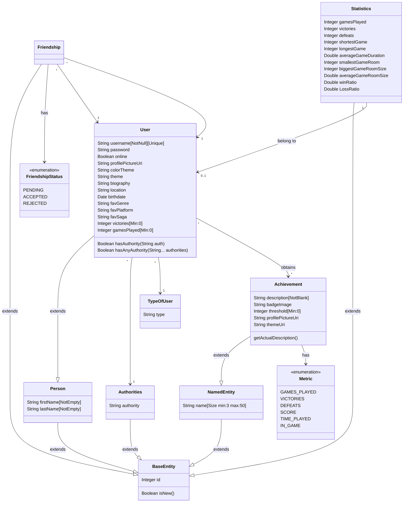
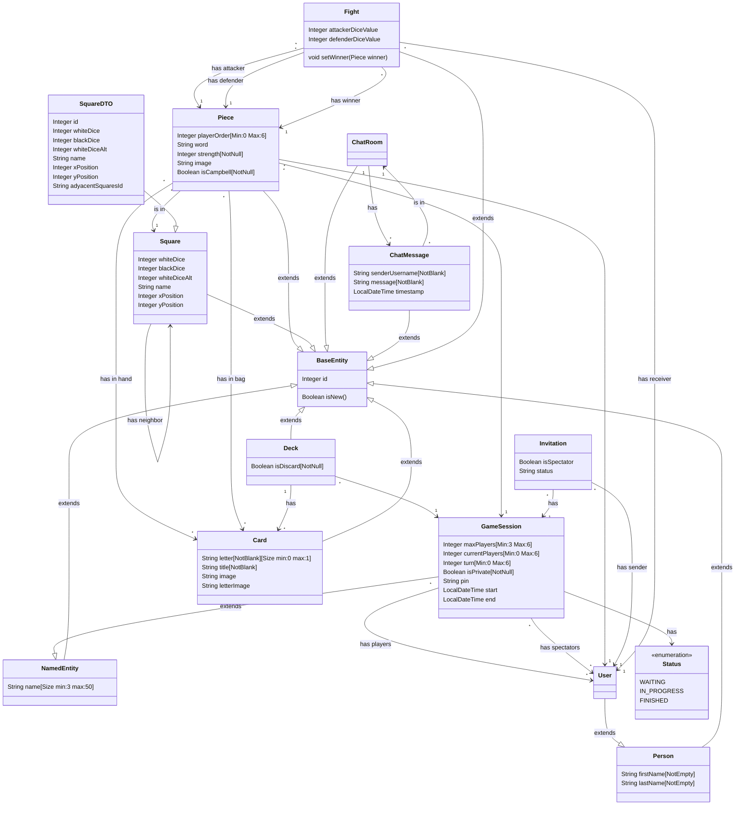

# System's Design Document


## Introducción

Our project will focus on developing a web implementation of the board game “Escape from Elba”, an exciting game that perfectly combines randomness and strategy, ideal for playing with family or friends in multiplayer mode (for 3-6 players per game). This project aims to attract a wide audience that enjoys not long strategy games.

"Escape from Elba" is a board game inspired by the historical escape of Napoleon Bonaparte from the island of Elba in 1814. In this game, the board represents “Elba”, and each player believes they are Napoleon. Players compete against each other to escape from the island before anyone else while interacting with NPCs (non-player characters) and Niall Campbell.

The system relies on a dice-based mechanic to track players' progress and determine the outcomes of confrontations. Players also manage a hand of cards that represent letters needed to form words. These words are placed in each player's "bag" and can be used as weapons or as escape words.


[Link to the explanatory game:](https://youtu.be/KsqosVhIw4g)

## UML Diagrams:

### Diagrama de Dominio/Diseño




_En este caso hemos vuelto a usar mermaid para crear el diagrama de dominio/diseño, pero recuerda que puedes usar cualquier otra herramienta que consideres oportuno para crear tus diagramas e inclurlos en este document como imagen tal y como se explica en [este tutorial](https://www.baeldung.com/ops/github-readme-insert-image)_

### Diagrama de Capas (incluyendo Controladores, Servicios y Repositorios)


GameSessionRepository Queries: 
| **Query** | **Description** |
|-----------|-----------------|
| `@Query("SELECT g FROM GameSession g JOIN g.players p WHERE p.id = :userId AND g.status = :status")` | Finds active sessions by user and status. |
| `@Query("SELECT min(g.gameDuration) FROM GameSession g WHERE g.status = 'FINISHED' AND :userId IN (SELECT u.id FROM g.players u)")` | Finds the shortest game duration finished by a user. |
| `@Query("SELECT max(g.gameDuration) FROM GameSession g WHERE g.status = 'FINISHED' AND :userId IN (SELECT u.id FROM g.players u)")` | Finds the longest game duration finished by a user. |
| `@Query("SELECT avg(g.gameDuration) FROM GameSession g WHERE g.status = 'FINISHED' AND :userId IN (SELECT u.id FROM g.players u)")` | Calculates the average duration of games finished by a user. |
| `@Query("SELECT min(g.currentPlayers) FROM GameSession g WHERE g.status = 'FINISHED' AND :userId IN (SELECT u.id FROM g.players u)")` | Finds the smallest number of players in a game finished by a user. |
| `@Query("SELECT max(g.currentPlayers) FROM GameSession g WHERE g.status = 'FINISHED' AND :userId IN (SELECT u.id FROM g.players u)")` | Finds the largest number of players in a game finished by a user. |
| `@Query("SELECT avg(g.currentPlayers) FROM GameSession g WHERE g.status = 'FINISHED' AND :userId IN (SELECT u.id FROM g.players u)")` | Calculates the average number of players in games finished by a user. |
| `@Query("SELECT count(g) FROM GameSession g JOIN g.players p WHERE p.id = :userId AND g.status = 'FINISHED'")` | Finds the total number of games finished by a user. |
| `@Query("SELECT count(g) FROM GameSession g JOIN g.players p WHERE p.id = :userId AND g.status = 'FINISHED' AND g.winner.id = :userId")` | Finds the total number of wins by a user. |
| `@Query("SELECT min(g.gameDuration) FROM GameSession g WHERE g.status = 'FINISHED'")` | Finds the shortest duration of any finished game. |
| `@Query("SELECT max(g.gameDuration) FROM GameSession g WHERE g.status = 'FINISHED'")` | Finds the longest duration of any finished game. |
| `@Query("SELECT avg(g.gameDuration) FROM GameSession g WHERE g.status = 'FINISHED'")` | Calculates the average duration of all finished games. |
| `@Query("SELECT avg(g.currentPlayers) FROM GameSession g")` | Calculates the average number of players per session. |
| `@Query("SELECT sum(g.gameDuration) FROM GameSession g WHERE g.status = 'FINISHED'")` | Calculates the total time played in finished games. |
| `@Query("SELECT sum(g.gameDuration) FROM GameSession g WHERE g.status = 'FINISHED' AND :userId IN (SELECT u.id FROM g.players u)")` | Calculates the total time played by a user in finished games. |
| `@Query("SELECT count(g) FROM GameSession g WHERE g.status = 'FINISHED'")` | Counts the total number of finished games. |
| `@Query("SELECT count(g) FROM GameSession g WHERE g.status = 'IN_PROGRESS'")` | Counts the total number of active games in progress. |


UserRepository Queries:
| **Query** | **Description** |
|-----------|-----------------|
| `@Query("SELECT u, ... ORDER BY victories DESC")` | Retrieves all players ordered by the number of victories in finished games. |
| `@Query("SELECT u, ... ORDER BY gamesPlayed DESC")` | Retrieves all players ordered by the number of games played. |
| `@Query("SELECT u, ... ORDER BY winRatio DESC")` | Retrieves all players ordered by their win ratio. |
| `@Query("SELECT u, ... ORDER BY gamesPlayed DESC")` (friends) | Retrieves players and the user's friends (by ID) ordered by games played. |
| `@Query("SELECT u, ... ORDER BY victories DESC")` (friends) | Retrieves players and the user's friends (by ID) ordered by victories. |
| `@Query("SELECT u, ... ORDER BY winRatio DESC")` (friends) | Retrieves players and the user's friends (by ID) ordered by their win ratio. |
| `@Query("SELECT count(u) FROM User u WHERE u.authority.authority = 'PLAYER'")` | Counts the total number of registered players. |
| `@Query("SELECT count(u) FROM User u WHERE u.authority.authority = 'PLAYER' AND u.online = TRUE")` | Counts the number of players currently online. |


## Descomposición del mockups del tablero de juego en componentes
In this secction we will process the mockup of the game board. We will tag areas of the screen to identify components to implement. We will also specify the hierarchy of those components as well


  - App – Main component of the app
    - $\color{orange}{\textsf{GameBar – Substitute of the NavBar during the game that contains essential functions }}$
      - $\color{darkred}{\textsf{[ GameBarButton ]. Shows a GameBar Button with its functionalities}}$
      - $\color{pink}{\textsf{[ Players ]. Shows the players in game}}$
        -  $\color{darkred}{\textsf{[ Player ]. Shows information about a concrete player}}$
    - $\color{darkblue}{\textsf[ Board ] { Shows the game board. It is conformed of squares and edges}}$
    - $\color{blue}{\textsf{Your Turn – This component will indicate whether it is your turn to play or not}}$
      - $\color{darkgreen}{\textsf{[ Game Actions ] – Shows you the possible actions in the turn such as jump or end your turn }}$
    - $\color{purple}{\textsf{GamesEvolutionChart –Shows your action phase, whether it is draw, action, bag...}}$
    - $\color{yellow}{\textsf{Cards – Shows the cards in your hand}}$
    - $\color{red}{\textsf{Decks – Shows the deck of this concrete game session.}}$

## Documentación de las APIs
APIs have been successfully documented using Swagger annotations. 

## Design and Architectural Patterns
In this section, we will describe the design and architectural patterns that have been used in the project:

### Singleton Pattern
*Type*: Design Pattern

*Application Context*

Spring Boot extensively utilizes the Singleton pattern for managing and controlling the creation of beans (components managed by the Spring container). By default, Spring manages objects as singletons within the container unless specified otherwise.

*Classes or packages created*

Since the pattern is applied by Spring itself, we have not created additional classes for the implementation of said pattern.

*Advantages obtained by applying the pattern*

When you define a bean in Spring (for example, using annotations like @Component, @Service, @Repository, or @Controller), the Spring IoC container manages the lifecycle of these beans. By default, Spring manages these beans as singletons within its container, meaning that Spring creates only one instance of the bean and reuses it wherever that bean is injected or required.

### Dependency Injection
*Type*: Design Pattern

*Application Context*

Dependency Injection(DI) is a variant of the Inversion of Control principle. DI allows a class to delegate the responsibility of providing its dependencies to an external component such as a container.

*Classes or packages created*

The pattern is applied by Spring by the use of annotations such as Service or Autowired.

*Advantages obtained by applying the pattern*

DI provides a structured approach to achieve loose coupling, follows the Single Responsibility Principle by letting each class focus solely on its intended functionality while external systems provide required dependencies. 


### Proxy Pattern
*Type*: Design Pattern

*Application Context*

The Proxy Pattern is a structural design pattern where a proxy object acts as an intermediary for another object, controlling access to the target and adding additional functionality like logging, security or lazy initialization. It is used when methods are annotated with @Transactional or when Aspects are declared.

*Classes or packages created*

The pattern is applied by Spring by the use of annotations like @Transactional or the declaration of aspects.

*Advantages obtained by applying the pattern*

In Spring, proxies are primarily used to enhance beans dynamically at runtime without modifying their code. This for example, allows for transactions to start before the method is executed, allowing for committing or rollback after the method completes its execution, depending on the outcome

### State Pattern
*Type*: Design Pattern

*Application Context*

For our game, turns are sequential and sufficiently different from each other. In each of those phases, certain actions can be done over pieces. This allowed for the implementation of the State pattern for the pieces.

*Classes or packages created*

Several classes were created for this pattern, PieceState, ActionState, DrawState, DiscardState, BagState and WordState, which can be found in the following package: [Piece Package](../../src/main/java/es/us/dp1/lx_xy_24_25/your_game_name/piece/)

*Advantages obtained by applying the pattern*

The code is now more organized, with state-related code in separate classes, massively simplified by the reduction of extensive conditional structures in business logic and elimination of duplicated code.

### Builder Pattern
*Type*: Design Pattern

*Application Context*

For our game, there are different types of pieces that have to be created for the game, that is Nial Campbell and the other non-player pieces and the pieces for the players. Then, since they will have different values for their attributes, we considered fitting the opportunity to use the Builder Pattern

*Classes or packages created*

Several classes were created for this pattern, AbstractPieceBuilder, CampbellPieceBuilder, NonPlayerPieceBuilder, PieceBuilder, PieceBuilderDirector and PlayerPieceBuilder: [Builder Package](../../src/main/java/es/us/dp1/lx_xy_24_25/your_game_name/piece/builder)

*Advantages obtained by applying the pattern*

The code is now more organized and has better reusability. Construction code is isolated from the business logic and structured step by step.

### Dispatchler Servlet/Front Controller
*Type*: Design Pattern

*Application Context*

Spring uses the Front Controller pattern as a tool for the implementation of the MVC architecutral pattern. It provides a centralized entry point for the handling of requests, that are then dispatched to the appropriate handlers, enforcing separation of concerns and code reusability.

*Classes or packages created*

The Dispatchler Servlet is automathically configured by Spring.

*Advantages obtained by applying the pattern*

The application has a centralized way of handling requests that simplifies request processing and improves maintainability. Also, improves reusability and modularity since common functionalities like authentication and logging are handled centrally. Also, allows for scalability.

### Pagination Pattern
*Type*: Design Pattern

*Application Context*

For our application, there are several areas where a lot of information can be displayed so we have decided to break it down into pages, using the pagination pattern, for example, for the ranking or achievement listing.

*Classes or packages created*

Although no specific classes were created, some special datatypes as Page and Pageable were used in the repositories, services and controller related with the listing of those elements previously mentioned.
*Advantages obtained by applying the pattern*

Easier and more manageable control for bigger sections of data.

## Design Decisions
_In this section, the design decisions that have been taken during the implementation of the project apart from the patters applied will be described._

### Decision 1: Validating words:

During a game, players must form valid English Words with the letters of their bag to accomplish different things such as catapulting to different areas or creating weapons, then we thought of many words to validate said words.

#### Evaluated Solution Alternatives:
*Alternative 1.1*: Using word-net:

*Advantages:*
*    Simple, word-net already offers a txt file that contains the most common 3000 English words.
*    We would just need to make a custom validator for the words.

*Disadvantages:*
*    The game does not offer the possibility of using all letters in the alphabet, just those within the cards so that when filtering, the selection fell short.
*    Frequent words that could be formed such as "cap" were not included in the file

*Alternative 1.2*: Using Oxford- Dictionary API:

*Advantages:*
*    Could validate any word easily
*    The API offers testing facilities so that we could easily make the POJO from the JSON schema

*Disadvantages:*
*    The API had a limit of only 300 calls per day
*    Plurals do not have dictionary entries
*    The API had a limit of 60 calls per minute
*    Would have to also check for the business rules related to the formation of the word

*Alternative 1.3*: Using WordsAPI:

*Advantages:*
*    Could validate any word easily
*    The API offers testing facilities so that we can easily make the POJO from the JSON schema

*Disadvantages:*
*    The API had a limit of 2500 calls per day but required a payment method to create a token
*    Plurals do not have dictionary entries
*    Would have to also check for the business rules related to the formation of the word

*Alternative 1.4: Using a custom text file*

*Advantages:*
*    Simple to use, since the file is made by us we could ensure that all frequent words in the game were included.
*    To implement it, we just have to create a custom validator for the word.
*    We could ensure that plurals are contained in the file

*Disadvantages:*
*    The file would have to be made from scratch

#### Justification of the chosen solution

Since we do not want to be limited to some daily calls for the application, we decided to choose alternative 1.4 since it would also allow to check for the implied business rules related to the creation of the word within the custom validator


### Decision 2: Creating Players and Pieces:

During a game, users must have pieces that represent them during the game, however there are also pieces associated to non-users that are manipulated by the playing users. Those pieces do not have hands or bags

#### Evaluated Solution Alternatives:
*Alternative 2.1*: Unifying players and pieces into one Entity

*Advantages:*
*    Would allow for creating one table less in the database

*Disadvantages:*
*    More complicated business logic since the REST Controller for the player would have more methods and a lot of conditional structures

*Alternative 2.2*: Separating Pieces and Players into two separate entities:

*Advantages:*
*    Would allow for simpler logic, since functionalities would be split between both entities and their associated classes
*
*Disadvantages:*
*    An additional table would have to be created
*    Both piece and player would have to be related to the user


#### Justification of the chosen solution

Since we wanted to stick to the division of responsibilities principle, we have chosen alternative 2.2

### Decision 3: Choosing Initial Player:

At the start of a game, the initial player must be determined. In the original game, dices are thrown and the one with the highest score starts.

#### Evaluated Solution Alternatives:
*Alternative 3.1*: Rolling dices

*Advantages:*
*    The users would visually see the process of determining the player

*Disadvantages:*
*    More data would have to be stored at the beginning of the game
*    Much slower start
*    More API calls to edit the players' turns

*Alternative 3.2*: Automatically assign it when creating the players :

*Advantages:*
*    Would allow for simpler logic, since the starting player would be randomly assigned from the beginning
*    Fewer API calls to start the game
*    Faster approach, players could start playing with just one click
  
*Disadvantages:*
*    Not as visual as the first option


#### Justification of the chosen solution

Since we want the games to start faster and we want to optimize the code, we have chosen alternative 3.2

### Decision 4: Choosing a Profile Picture:

Players should be able to customize their profile, including their profile picture. However, we thought of many ways to do that:

#### Evaluated Solution Alternatives:
*Alternative 4.1*: Storing any picture as a lob

*Advantages:*
*    Users would have more freedom by choosing whatever image they want

*Disadvantages:*
*    More complicated management to display them properly
*    There would be no control over what pictures can be displayed

*Alternative 4.2*: Add profile pictures and background colors as rewards :

*Advantages:*
*    Would allow for simpler logic, since the pictures would be just strings in the local files of the project
*    Incentivates the user to play and unlock different options
*    Allows to have control over 
  
*Disadvantages:*
*    More limited customization


#### Justification of the chosen solution

Since we want the game to have a more defined aesthetic and we want to avoid inappropriate content, we have chosen alternative 4.2


### Decision 5: Modelling the Board:

Our game has a complex board so we had to consider different options on how to model it :

#### Evaluated Solution Alternatives:
*Alternative 5.1*: Unidirectional relationships between Squares:

*Advantages:*
*    Fewer lines in the database

*Disadvantages:*
*    A unidirectional relationship would infer that a is a neighbour of b but not the other way around.

*Alternative 5.2*: Bidirectional relationships between Squares:

*Advantages:*
*    Easier to code, a bidirectional relationship would mean that a is a neighbour of b and vice versa
*    Easier to translate to a graph in the frontend

*Disadvantages:*
*    More computationally costly

*Alternative 5.3*: A Matrix:

*Advantages:*
*    Easier to code, each square is a cell of the matrix and its neighbors are the colliding cells in rows and columns

*Disadvantages:*
*    There is a square with 6 neighbours so that diagonal traversing would have to be implemented.


#### Justification of the chosen solution

Since we wanted to take into account the bi-directionality of the neighbouring squares, we have decided to apply alternative 5.2

## Applied Refactoring:

### Refactoring 1: 
In this refactoring, we have added some elements to the GameSession entity so that it was more complete and easier to track the turns:
#### Initial State of the code
```Java 
public class GameSession extends BaseEntity {
    @Id
    @GeneratedValue(strategy = GenerationType.IDENTITY)
    protected Integer id;   

    @Min(3)
    @Max(6)
    private Integer maxPlayers;

    @Column(columnDefinition = "ENUM('IN_PROGRESS', 'FINISHED', 'WAITING')")
    private String status = "WAITING";

    @Min(0)
    @Max(6)
    private Integer currentPlayers = 1;

    @NotNull
    public Boolean isPrivate = false;

    private String pin;

    @ManyToOne
    @JoinColumn(name = "creator_id")
    private User creator;

    @ManyToMany
    @JoinTable(name = "game_session_users",
            joinColumns = @JoinColumn(name = "game_session_id"),
            inverseJoinColumns = @JoinColumn(name = "user_id"))
    private List<User> players = new ArrayList<>();
``` 
_Puedes añadir información sobre el lenguaje concreto en el que está escrito el código para habilitar el coloreado de sintaxis tal y como se especifica en [este tutorial](https://docs.github.com/es/get-started/writing-on-github/working-with-advanced-formatting/creating-and-highlighting-code-blocks)_

#### Status of the refactored code

``` Java
public class GameSession extends NamedEntity {
    

    @Min(3)
    @Max(6)
    private Integer maxPlayers;

    @Column(columnDefinition = "ENUM('IN_PROGRESS', 'FINISHED', 'WAITING')")
    private String status = "WAITING";


    @Min(0)
    @Max(6)
    private Integer currentPlayers = 1;

    @Min(0)
    @Max(6)
    private Integer turn = 0;

    @NotNull
    public Boolean isPrivate = false;

    private String pin;

    @ManyToOne
    @JoinColumn(name = "winner_id")
    private User winner;

    @Column(name = "startTime")
    public LocalDateTime start = null;

    @Column(name = "endTime")
    public LocalDateTime end = null;

    @ManyToOne
    @JoinColumn(name = "creator_id")
    private User creator;

    @ManyToMany
    @JoinTable(name = "game_session_users",
            joinColumns = @JoinColumn(name = "game_session_id"),
            inverseJoinColumns = @JoinColumn(name = "user_id"))
    private List<User> players = new ArrayList<>();
}
```
#### Problems that lead to the refactoring
The previous structure did not have a winner and an indicator of the game turn so it was difficult to keep track of those aspects. 
#### Advantages of the new code
Now we can manage a lot better the turn system in the game and we can implement other metrics for the Achievements such as the Time played. Now that the games have a name it is easier to locate them.

### Refactoring 2: 
In this refactoring, we have added some properties to the achievements so that the claiming system could be implemented:
#### Initial State of the code
```Java
public class Achievement extends NamedEntity {
    @NotBlank
    private String description;
    private String badgeImage;
    @Min(0)
    private int threshold;

    @Enumerated(EnumType.STRING)
    @NotNull
    Metric metric;
    
    public String getActualDescription(){
        return description.replace("<THRESHOLD>",String.valueOf(threshold));
    }
}
```
#### Status of the refactored code
```Java
public class Achievement extends NamedEntity {
    @NotBlank
    private String description;
    private String badgeImage;
    @Min(0)
    private int threshold;

    @Enumerated(EnumType.STRING)
    @NotNull
    Metric metric;

    private String profilePictureUri;

    private String themeUri;
    
    public String getActualDescription(){
        return description.replace("<THRESHOLD>",String.valueOf(threshold));
    }
}
```

#### Problems that lead to the refactoring
The previous structure did not have any attributes for the rewards system
#### Advantages of the new code
Now we can manage the rewards from the User since the achievements have profilePicture or a theme.

### Refactoring 3: 
In this refactoring, we have added some properties to the user to ensure the customization according to some restrictions:
#### Initial State of the code
```Java
public class User extends Person {

	@Column(unique = true)
	String username;

	String password;

	@NotNull
	@ManyToOne(optional = false)
	@JoinColumn(name = "authority")
	Authorities authority;

	@Lob
    @Column(name = "profile_picture")
    byte[] profilePicture;  


	public Boolean hasAuthority(String auth) {
		return authority.getAuthority().equals(auth);
	}

	public Boolean hasAnyAuthority(String... authorities) {
		Boolean cond = false;
		for (String auth : authorities) {
			if (auth.equals(authority.getAuthority()))
				cond = true;
		}
		return cond;
	}
```
#### Status of the refactored code
```Java
public class User extends Person {

	@NotNull
	@Column(unique = true)
	String username;

	String password;

	@Column(nullable = true)
	Boolean online = false;

	@NotNull
	@ManyToOne(optional = false)
	@JoinColumn(name = "authority")
	Authorities authority;
	
    @Column(name = "profile_picture")
	String profilePictureUri = "/napoleonColores.png";

	@Column(name = "profile_picture_color")
	String colorTheme = "#101010";

	@Column(name = "theme")
	String theme;

	@Min(0)
	Integer victories = 0;

	@Min(0)
	Integer gamesPlayed = 0;

	@ManyToMany(cascade = {CascadeType.PERSIST, CascadeType.MERGE})
	@JoinTable(name = "user_achievements",
			joinColumns = @JoinColumn(name = "user_id"),
			inverseJoinColumns = @JoinColumn(name = "achievement_id"))
	private List<Achievement> obtainedAchievements = new ArrayList<>();

	public Boolean hasAuthority(String auth) {
		return authority.getAuthority().equals(auth);
	}

	public Boolean hasAnyAuthority(String... authorities) {
		Boolean cond = false;
		for (String auth : authorities) {
			if (auth.equals(authority.getAuthority()))
				cond = true;
		}
		return cond;
	}

}
```

#### Problems that lead to the refactoring
The previous structure did not have any relationship with the Achievements that the user has and did not have the current system of customization.
#### Advantages of the new code
Now we can properly manage the customization of the user.

### Refactoring 4: 
In this refactoring, we introduced an auxiliary function named apiFetch to centralize and simplify API call logic, thereby reducing code duplication and improving maintainability. By abstracting away repetitive configurations like headers, HTTP methods, and error handling, we streamlined functions such as handlePieces
#### Initial State of the code
```Javascript
    const handlePieces = async (gameSession) => {
        if (gameSession.status === 'WAITING') {
            try {
                const response = await fetch(`api/v1/pieces/${gameSession.id}`, {
                    headers: {
                        Authorization: `Bearer ${jwt}`,
                        Accept: 'application/json',
                        'Content-Type': 'application/json',
                    },
                });
                const piecesData = await response.json();
                if (piecesData.length > 0) {
                    return;
                }
                await fetch(
                    `/api/v1/pieces?gameId=${gameSession.id}`,
                    {
                        method: 'POST',
                        headers: {
                            Authorization: `Bearer ${jwt}`,
                            Accept: 'application/json',
                            'Content-Type': 'application/json',
                        },
                        body: JSON.stringify(gameSession),
                    }
                );
            } catch (error) {
                console.error('Error handling pieces:', error);
            }
        }
    }
```
#### Status of the refactored code
```Javascript 
    const handlePieces = async (gameSession) => {
        if (gameSession.status === 'WAITING') {
            try {
                const piecesData = await apiFetch(`/api/v1/pieces/${gameSession.id}`);
                if (piecesData.length === 0) {
                    await apiFetch(`/api/v1/pieces?gameId=${gameSession.id}`, 'POST', gameSession);
                }
            } catch (error) {
                console.error('Error handling pieces:', error);
            }
        }
    };
```

#### Problems that lead to the refactoring
Repeated API call configurations (e.g., headers and methods) across the codebase created unnecessary redundancy and increased maintenance complexity.
#### Advantages of the new code
The apiFetch function centralizes API logic, ensuring consistency and reducing code duplication, so functions are cleaner and easier to read, improving overall code quality and maintainability.

### Refactoring 5:  
During the refactoring process, we identified that the Game.js file was overly bloated, handling too many responsibilities, such as game logic, modal management, and specific functionalities like dice, cards, and piece handling. This monolithic design made the code harder to read, maintain, and scale. To address these issues, we decided to modularize the various functionalities into separate components, achieving a cleaner and more organized design.
#### Problems that lead to the refactoring
The Game.js file was overloaded with multiple functionalities, leading to the following issues:

- **Complexity**: Its large size and the variety of tasks it handled made understanding and modifying the code challenging.  
- **Lack of clarity**: Core game logic was mixed with auxiliary functions and UI components, making the file hard to navigate.  
- **Scalability issues**: Adding new features or modifying existing ones risked introducing errors due to the tightly coupled code.  

#### Advantages of the new code
We modularized the Game.js file by separating its functionalities into distinct components, such as Dice.js for dice logic, Card.js for card handling, and modals like BagModal.js and JumpModal.js. This approach improved the following:

- **Code readability**: Each component now focuses on a single responsibility, making the codebase easier to understand.  
- **Maintainability**: Changes or additions can be implemented in isolated components without affecting unrelated parts of the code.  
- **Scalability**: The modular design makes it easier to extend functionality or add new features without risking the stability of the core logic.

### Refactoring 6: 
In this refactoring, we completely changed the functionality of the chat of the games, that originally was implemented with a constant polling and now has been refactored to use the WebSockets protocol. Using in backend the dependency of SpringBoot Starter Websockets and in frontend making use of SockJS and Stomp. 
#### Initial State of the code
```Javascript
    export default function Chat({ onSendMessage, messages }) {
    const [message, setMessage] = useState('');

    const handleKeyPress = (event) => {
        if (event.key === 'Enter' && message.trim()) {
            onSendMessage(message.trim()); // Llama a la función pasada por props
            setMessage(''); // Limpia el campo de texto
        }
    };

    return (
        <div className="chat-container">
            {/* Contenedor para mostrar los mensajes */}
            <div className="messages-container">
                {Array.isArray(messages) && messages.map((msg, index) => (
                    <div key={index} className="message-item">
                        <strong>{msg.senderUsername}:</strong> {msg.message}
                    </div>
                ))}
            </div>

            {/* Input para escribir un mensaje */}
            <input
                type="text"
                value={message}
                onChange={(e) => setMessage(e.target.value)}
                onKeyPress={handleKeyPress}
                placeholder="Send a message..."
                className="chat-input"
            />
        </div>
    );
}

```
#### Status of the refactored code
```Javascript 
const Chat = ({ chatRoomId = 1, isOpen, onClose }) => {
  const [stompClient, setStompClient] = useState(null);
  const [message, setMessage] = useState("");
  const [messages, setMessages] = useState([]);
  const nickname = user.username;
  const messagesEndRef = useRef(null);

  useEffect(() => {
    const loadPreviousMessages = async () => {
      try {
        const response = await fetch(`/api/v1/chat/messages?id=${chatRoomId}`, {
          method: "GET",
          headers: {
            "Content-Type": "application/json",
            Authorization: `Bearer ${jwt}`,
          },
        });

        if (response.ok) {
          const roomMessages = await response.json();
          setMessages(roomMessages.map((msg) => ({
            senderUsername: msg.senderUsername,
            message: msg.message,
          })));
        } else {
          console.error("Error while retrieving messages", response.statusText);
        }
      } catch (error) {
        console.error("Error while retrieving messages: ", error);
      }
    };

    const socket = new SockJS("http://localhost:8080/socket-chat");
    const client = Stomp.over(socket);

    client.connect({}, () => {
      client.subscribe(`/topic/chat/${chatRoomId}`, (response) => {
        const newMessage = JSON.parse(response.body);
        setMessages((prev) => [...prev, newMessage]);
      });
      setStompClient(client);
    });

    loadPreviousMessages();

    return () => {
      if (client) client.disconnect();
    };
  }, [chatRoomId]);

  useEffect(() => {
    messagesEndRef.current?.scrollIntoView({ behavior: "smooth" });
  }, [messages]);

  const sendMessage = async () => {
    if (stompClient && message.trim()) {
      const chatMessage = {
        senderUsername: nickname,
        message: message.trim(),
        chatRoomId,
      };

      try {
        const response = await fetch(`/api/v1/messages?senderId=${user.id}&chatRoomId=${chatRoomId}`, {
          method: "POST",
          headers: {
            "Content-Type": "application/json",
            Authorization: `Bearer ${jwt}`,
          },
          body: chatMessage.message,
        });

        if (!response.ok) {
          console.error("Error while sending the message:", response.statusText);
          alert("Error while sending the message. Try it again.");
        } else {
          stompClient.send(`/app/chat/${chatRoomId}`, {}, JSON.stringify(chatMessage));
          setMessage("");
        }
      } catch (error) {
        console.error("Error while sending the message:", error);
      }
    } else {
      alert("Couldn't send the message. Make sure the message is not empty.");
    }
  };

  if (!isOpen) return null;

  return (
    <div className="chat-overlay">
      <div className="chat-container">
        <div className="chat-header">
          <h3>Chat</h3>
          <button className="close-btn" onClick={onClose}>
            ✖
          </button>
        </div>
        <div className="messages-container">
          {messages.map((msg, index) => (
            <div key={index} className="message">
              <strong>{msg.senderUsername}</strong>: {msg.message}
            </div>
          ))}
          <div ref={messagesEndRef} />
        </div>
        <div className="input-container">
          <input
            type="text"
            value={message}
            onChange={(e) => setMessage(e.target.value)}
            onKeyPress={(e) => e.key === "Enter" && sendMessage()}
            placeholder="Send a message..."
          />
          <button onClick={sendMessage}>Enviar</button>
        </div>
      </div>
    </div>
  );
};

export default Chat;
```

#### Problems that lead to the refactoring
The technique used was not the most efficient one for implementing a chat since it would have to constantly check if there were any new messages.
#### Advantages of the new code
The WebSockets protocol enables the automatic transmission of messages to the server as soon as a new message is generated.

### Refactoring 7
#### Initial State of the Code
The components `login`, `register`, `logout`, and `profile` were implemented as separate routes in the application. Navigating to these features required full page transitions, interrupting the user flow. Additionally, the components `app` and `home` required modifications to support the updated navigation approach.
#### Problems that lead to the refactoring
The use of routes for `login`, `register`, `logout`, and `profile` caused a less fluid user experience (UX) as transitions between these sections involved route changes, making the application feel slower. The structure of `app` and `home` needed adjustments to accommodate these changes effectively.
#### Advantages of the new code
By transforming `login`, `register`, `logout`, and `profile` into modals instead of routes, we significantly enhanced the UX. Interactions with these features now feel seamless, as there are no full page transitions. Modifications to `app` and `home` ensured smooth integration of the new modal-based design, providing a more cohesive and responsive user experience.
